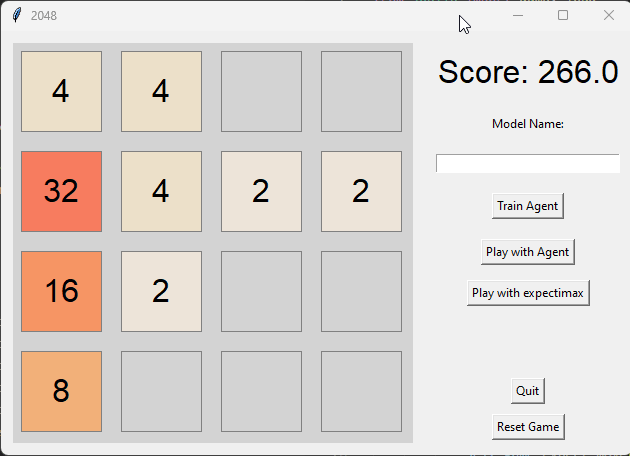
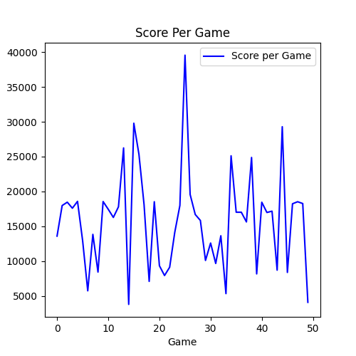
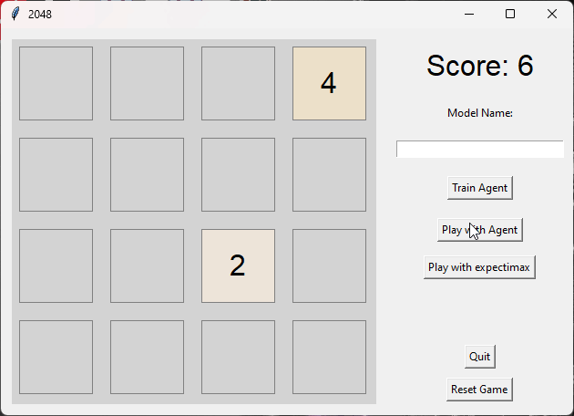
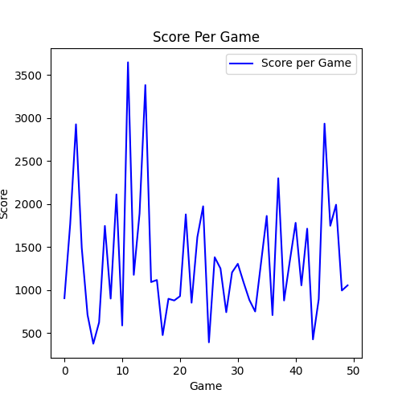

# 2048 - Playing Games Using An AI and Algorithmic approach

---

## Overview

This project is a Python implementation of the game 2048, enhanced with two techniques for playing the game: Expectimax and Q-Learning (Deep Q-Network). This project seeks to understand the benefits and drawbacks of the different methods of playing games, as well as provide a playable experience.

2048 was originaly created in 2014 by [Gabriele Cirulli](https://github.com/gabrielecirulli/2048)[^1]. The game can be played online at [play2048.co](https://play2048.co/)[^2]

---


## Table of Contents

1. [Features](#features)
2. [Installation](#installation)
3. [Usage](#usage)
   - [Playing the Game](#playing-the-game)
   - [Training the Q-Learning Agent](#training-the-q-learning-agent)
   - [Playing with Q-Learning Agent](#playing-with-q-learning-agent)
   - [Playing with Expectimax Agent](#playing-with-expectimax-agent)
4. [File Descriptions](#file-descriptions)
5. [Expectimax](#expectimax)
6. [Deep Q Network](#deep-q-network)
7. [Comparing Approaches](#comparing-approaches)
8. [License](#license)
9. [References](#references)

---

## Features

1. **Game Implementation**: The core 2048 game logic.
2. **Expectimax Agent**: An AI agent using the Expectimax algorithm to play the game.
3. **Q-Learning Agent**: A Deep Q-Network (DQN) agent that learns to play the game using Q-Learning.
4. **Pretrained Model**: A model that has previously trained on the game.
5. **GUI**: A graphical user interface for interacting with the game and the AI agents.

---

## Installation

To use this library, you will need Python 3.6+ and the following Python packages:
- `numpy`
- `tkinter`
- `matplotlib`
- `scikit-learn`
- `joblib`

You can install the necessary packages using pip:
```sh
pip install numpy matplotlib scikit-learn joblib
```

---

## Usage

### Playing the Game

To start playing the game with the graphical user interface:

- Run the `driver.py` script. This will launch a window where you can interact with the game using the GUI.
- Use the arrow keys or GUI buttons to make moves and interact with the game. 

### Training the Q-Learning Agent

1. **Train a New Q-Learning Agent**:
   - Use the GUI to initiate the training process by clicking the "Train Agent" button. The agent will learn by playing the game over a specified number of episodes.
     - Use the model name textbox to choose a name for your model. If no name is input, the model will save as `2048_agent.pkl`
   - During training, you'll see the agent's score and epsilon value displayed. The model will be saved periodically to track progress.

2. **Custom Training**:
   - You can customize training parameters such as the number of episodes, or load different agent configurations by modifying the `train_agent` method within the `GUI` class.

### Playing with Q-Learning Agent

1. **Play the Game Using the Q-Learning Agent**:
   - To have the Q-Learning agent play the game, select the "Play with Agent" option in the GUI. The agent will make moves based on its evaluation of the game state using the its Q network.
   - Use the model name textbox to choose a specific model to play with. If no name is input, or the input name does not exist, the agent will use the pretrained model provided.

### Playing with Expectimax Agent

1. **Play the Game Using the Expectimax Agent**:
   - To have the Expectimax agent play the game, select the "Play with Expectimax" option in the GUI. The agent will make moves based on its evaluation of the game state using the Expectimax algorithm.
  
---

## File Descriptions

- `driver.py`: Launches the game
- `trainer_2048.py`: Implements the game logic and graphical user interface using `tkinter`.
- `neural_net.py`: Defines the neural network layers and base `Network` class.
- `deep_q.py`: Contains the implementation of the `Q_Network` class for the Deep Q-Learning agent.
- `player_expectimax.py`: Includes the `Expectimax_Agent` class for the Expectimax algorithm.
  
---

## Expectimax

The Expectimax agent employs a probabilistic method to determine the best moves by evaluating all possible future game states and their associated probabilities. It recursively explores potential moves and tile placements, aiming to optimize the expected score based on the current game state. 

**Key Features**:
- Recursive exploration of possible moves.
- Evaluation of board states using the Expectimax algorithm.
- Memoization to optimize performance by avoiding redundant evaluations of board states.
- Alpha-beta pruning to optimise performance by avoiding lesser-performing branches.

---

## Deep Q Network

The Deep Q-Learning agent leverages a Deep Q-Network (DQN) to learn how to play the game through reinforcement learning techniques[^4]. This agent learns from its experiences, adjusting its policy based on the rewards it receives during gameplay.

**Key Features**:
- Neural network architecture for approximating Q-values.
- Experience replay mechanism to learn from past experiences.
- Use of a target network to stabilize training.
- Epsilon-greedy strategy to balance exploration and exploitation.

---

## Comparing Approaches

### Development Time and Complexity

**Expectimax Agent:**

- **Time Taken**: Developing the Expectimax agent was relatively quick. The Expectimax algorithm, being a recursive search method with comparatively much less complexity than a Deep-Q network, required less time to implement compared to the Q-Learning approach. 
- **Complexity**: The primary challenges involved implementing the recursion, pruning, and memoization.
  - Although I have used alpha-beta pruning in the pass for a chess game, adapting that into a single player game took a small amount of thinking to solve.
  - Deciding how to evaluate the board at a chance step was also a consideration, but using example pseudocode[^3] as a reference, I was able to understand how to implement this step.
  - Given that the game has a large number of possible states (if we consider that a cell may have an power of 2 value between 0 and 65536, there are in theory 48 quintillion possible board states), and that we would not see most of these states in a single game, I decided that the memoization dictionary should be saved after a game, and loaded before another game so as to keep track of board states the game has previously seen. I then ran the expectimax algorithm repeatedly on a game of 5 moves before resetting, so that a lot of initial states could be accounted for in an attempt to speed up the beginning of games.


**Deep Q-Network (DQN) Agent:**

- **Time Taken**: Developing the Deep Q-Network agent took considerably more time than expectimax.
  - The complexity of designing and training a neural network, along with setting up the reinforcement learning framework, added significant overhead.
  - Hyperparametre tuning also played a large part in increasing the time necessary, with several trials needed to attempt to discover an optimal network configuration.
  - Training such a complex model also takes a considerable amount of time, and had to be done over a span of several days, running for several hours at a time before saving to be loaded and trained further the next day.
- **Complexity**: Key challenges included choosing appropriate hyperparameters, tuning the neural network architecture, and ensuring stable training. The setup for experience replay, target networks, and balancing exploration with exploitation added layers of complexity.
  - With over 10 seperate hyperparametres to optimise, and the inability to train a network at the required scale quickly, a lot of time and computational resources were spent performing grid searches and training with small changes, with ultimately no useful results.
  - Choosing a network architecture was very difficult, as the network needed to be complex enough to recognise the best moves when random chance is considered, while also being able to be trained in a semi-reasonable length of time.
  - Stable training was very hard to achieve, due mostly to the unpredictable nature of the random cell positioning at each step of the game.
  - As Deep-Q networks are very complex, and require a different training setup to a regular neural network, I made several mistakes during the process of creating the code which ultimately led to large amounts of time lost due to the need to fix errors and optimise the code.
 
### Finding Hyperparametres

Throughout development, I attempted to use a large number of different hyperparametres to find the optimal set to play 2048. When I began, I attempted to discover these parametres myself, and would forego research into other people's implementations. This led to a lot of failed models, most of which I now believe failed due to a lack of complexity in the network architecture.


In early training attempts, I used relatively small networks of, for example, 2 hidden layers and an output layer. The two graphs on the left show the score achieved over 1000 episodes of training using a network of 2 hidden layers of 32 nodes each, and the two on the right show the same stat for networks with 2 hidden layers of 64 nodes each. As is clear from the graphs, there was no significant increase in the performance of any of the networks shown, which is a trend that extended to all other networks I trained at the time. My approach to this problem appeared to have issues, and so I decided to research into other implementations of the same problem.

After some research, I discovered a blog post by Rinat Maksutov, detailing their experiences with training a Q-learning network to play 2048.[^5] Upon reading through this blog, I began to understand the reasons for which my models were underperforming.

**Issues:**
- **Architecture:** The architecture of my models were inadequate for the complexity of the game. Where I had attempted to use layers of only 64 neurons, A better approach would be to expand the network to 3 hidden layers of 1024 neurons each.
- **Reward System:** The reward system I had been using was to simply take the score, and deduct a penalty if the game finished on that move. This system, however, would not allow the network to learn the usefulness of future prospects, and the large variety in the possible score was likely to give the reward little meaning to the AI. A better reward system prioritised certain moves over others, accounted for possible future moves, and rewarded the model within a smaller range of values based on the models ability to cause the score to increase at each given move.
- **Network inputs:** Given the large difference possible between values in cells, the meaning behind the raw cell values would have little meaning to the AI. Instead, a better approach would be to one hot encode the inputs, so that the network would have 256 inputs as opposed to only 16.
- **Training:** I had originally been training my network on small batches of experiences, once per game. A better approach was to increase the size of each training batch, and to train multiple times after a game to speed up training.
- **GPU Processing:** My code was not written with GPU processing in mind. In the development of AI, it is generally accepted that performing calculations using CUDA cores is the best way to train a large AI system. Unfortunately, I do not have a CUDA compatible GPU, and my code was not written with GPU processing in mind. If I were to rewrite the code to allow the use of the GPU, I would not have be able to reap its benefits, and therefore my models will train very slowly.

After considering and improving these issues, and fixing the many errors I encountered from attempting to make these changes, I was able to begin training a new network. This network, due to its very large size compared to my previous attempts, took a very long time to train, even after a single game. Because of this, I decreased the number of episodes the agent trained for, and saved the model after every 5 episodes. Doing this allowed me to let the training run for longer without worrying about the time taken, as I would be able to train more later should my computer need to stop training.  Unfortunately, the lack of GPU support has greatly hindered this project.

### Comparing Approaches over a number of games

Once the Q-learning model had been trained for a sufficient amount of time, such that its performance was more consistently higher, I was able to begin pitting the two approaches against each other, to find which would perform better overall.

For each approach, I had the agent play a set of 50 games, and recorded the score achieved by the agent at the end of each game. I then plot this data on a graph of game number against score. This would allow me to compare the maximum scores, average scores, and how consistent the agent performed.

**Expectimax:**

|  |  |
|:-------------------------------------------:|:------------------------------------------------------------:|

Expectimax performs very well. The agent consistently merges to a 1024 or 2048 tile, using a search depth of 3. At this depth, the game can run very quickly, with little time required to calculate the best next move. The random nature of 2048 does cause a large variance in the possible scores, however most games score above 15000 points, which is very successful. In the best game of the 50 sampled, the agent was able to score more than 40000 points. In this game, the agent created a 2048 and a 1024 which existed simultaneously, suggesting that the agent may have been able to produce a 4096 tile had the conditions been right.

**Q-Learning:**

|  |  |
|:-----------------------------:|:-------------------------------------------------:|

Due mostly to my inability to efficiently train such a large model, my Q-Learning approach to playing 2048 is very poor. The agent reached only a maximum tile size of 512, and did so with very little frequency. Along with poor scoring, the agent also takes a measurable amount of time to calculate the best move from certain board states, with a greater number of empty tiles corresponding with times at which the agent took longer to find a move. 

Overall, expectimax performs with much greater efficacy than Q-Learning when using my implementation of the two approaches. A very clear indicator of this fasct is that the maximum score achieved by the Q-Learning network was almost equal to that of the minimum score of the expectimax agent. When comparing the approaches on speed to calculate moves, score and tile size achieved, and time required to devise, code, and test an implementation, expectimax beats Q-Learning on all fronts. 
This is not to say, however, that Q-Learning could not be a viable approach. Based on work done by others, notably Rinat Maksutov[^5], it is clear that Q-Learning can be a well performing approach, if given the time and computational resources to train an adequately complex model.

This project has allowed me to explore the use of recursion, neural networks, Q-Learning, and the influence of randomness on the outcome of a program. Along with this, I have been able to practice my python and problem solving skills, and ultimately have produced a simple program that I am happy with.

---

## License
---

Feel free to contribute to this project by submitting issues or pull requests. For any questions or further information, please contact the project maintainer.

---

**Notice**: You are free to use, modify, and distribute this code as needed. The author of this project is Lewis Murphy, @defalt0402. If you have any questions or need further clarification, please reach out!

---

## References

[^1]: [2048 Game](https://play2048.co/): Play the classic 2048 game online.
[^2]: [Gabriele Cirulli's GitHub](https://github.com/gabrielecirulli/2048): Original repository for the 2048 game.
[^3]: [Expectimax Algorithm](https://www.baeldung.com/cs/expectimax-search): Overview of the Expectimax algorithm.
[^4]: [Deep Q-Learning Research Paper](https://www.cs.toronto.edu/~vmnih/docs/dqn.pdf): Detailed paper on Deep Q-Learning.
[^5]: [A puzzle for AI: How I taught an AI to play 2048](https://towardsdatascience.com/a-puzzle-for-ai-eb7a3cb8e599): A blog post detailing the training of a 2048 deep-q model.
